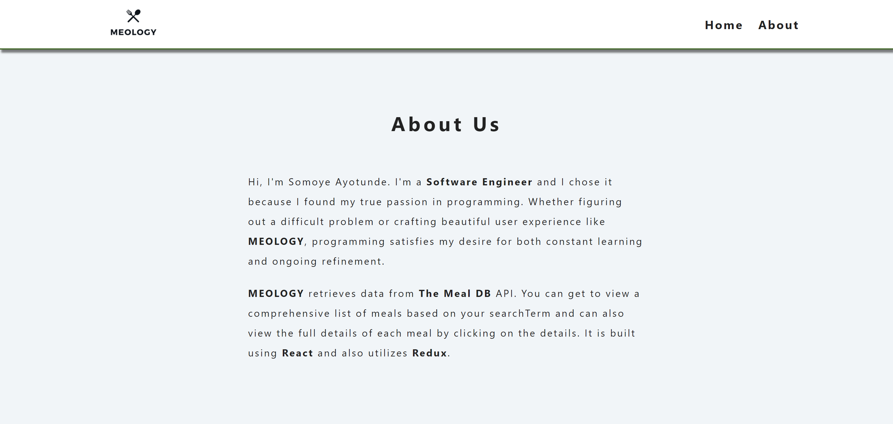
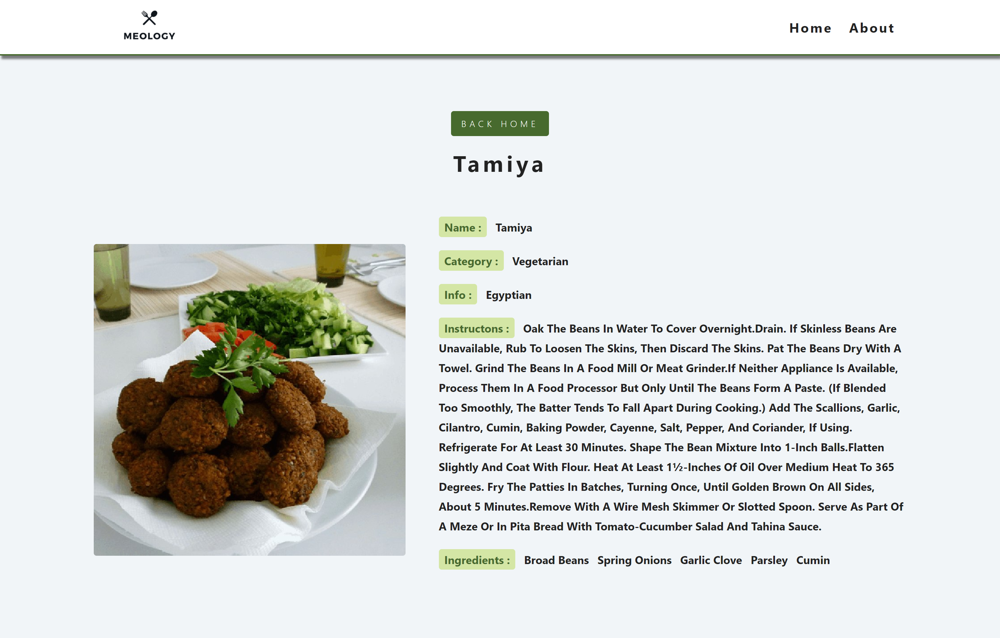

<h1 align="center">
  Meology
</h1>

<strong>MEOLOGY</strong> retrieves data from <strong>The Meal DB</strong> API. You can get to view a comprehensive list of meals based on your search Term and can also view the full details of each meal by clicking on the details. It is built using <strong>React</strong> and also utilizes <strong>Redux</strong>.

**Home Page**

  

**About Page**

  

**Single Meal Page**

  

## live demo
[Meology](https://somoye-meology.netlify.app)

## Features
- A list of food menu from different countries .
- You can get to view a comprehensive list of meals based on your search Term.
- When the details button of item in the menu is clicked, the full details will be displayed.
- You can navigate back to the home page and about page.

### Production Dependencies

| **Dependency**   | **Use**                                              |
| ---------------- | ---------------------------------------------------- |
| prop-types       | Declare types for props passed into React components |
| react            | React library                                        |
| react-dom        | React library for DOM rendering                      |
| react-redux      | Connects React components to Redux                   |
| react-router-dom | React library for routing                            |
| redux            | Library for unidirectional data flows                |
| redux-thunk      | Async redux library                                  |

### Development Dependencies

| **Dependency**                  | **Use**                                                          |
| ------------------------------- | ---------------------------------------------------------------- |
| babel-eslint                    | Lint modern JavaScript via ESLint                                |
| eslint                          | Lints JavaScript                                                 |
| eslint-plugin-react-hooks       | Adds additional React-hooks-related rules to ESLint              |
| eslint-plugin-import            | Advanced linting of ES6 imports                                  |
| eslint-plugin-react             | Adds additional React-related rules to ESLint                    |
| fetch-mock                      | Mock fetch calls                                                 |
| jest                            | Automated testing framework                                      |
| node-fetch                      | Make HTTP calls via fetch using Node - Used by fetch-mock        |
| react-test-renderer             | Render React components for testing                              |
| @testing-library                | Test React components                                            |
| redux-immutable-state-invariant | Warn when Redux state is mutated                                 |
| redux-mock-store                | Mock Redux store for testing                                     |
| stylelint                       | Lints Css                                                        |
| stylelint-config-standard       | Advanced linting configoration for css                           |
| stylelint-csstree-validator     | Advanced linting validation for css                              |
| stylelint-scss                  | Adds additional SCSS-related rules to StyleLint                  |

### Prerequisites

- Node
- Npm

### Setup

- git clone `https://github.com/somoye123/Meology`
- cd Meology
- npm install
- npm start
- **Install [React developer tools](https://chrome.google.com/webstore/detail/react-developer-tools/fmkadmapgofadopljbjfkapdkoienihi?hl=en) and [Redux Dev Tools](https://chrome.google.com/webstore/detail/redux-devtools/lmhkpmbekcpmknklioeibfkpmmfibljd?hl=en)** in Chrome

## Author

👤 **Somoye Ayotunde**

- Github: [@somoye123](https://github.com/somoye123)
- Twitter: [@ayotunde_197](https://twitter.com/ayotunde_197)
- LinkedIn: [somoye-ayotunde](https://www.linkedin.com/in/somoye-ayotunde)
- Mail: [somoye.ayotunde@gmail.com](somoye.ayotunde@gmail.com)

## 🤝 Contributing

Contributions, issues and feature requests are welcome!

Feel free to check the [issues page](https://github.com/somoye123/Meology/issues).

## Show your support

Give a ⭐️ if you like this project!

## Acknowledgments
  - Microverse
  - You can access all the design info (color, typography, layouts) in this link:
  - [Design](https://www.behance.net/gallery/31579789/Ballhead-App-(Free-PSDs))
  - Design idea by [Nelson Sakwa on Behance](https://www.behance.net/sakwadesignstudio)
